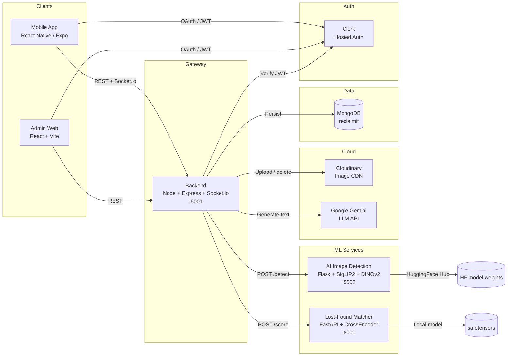
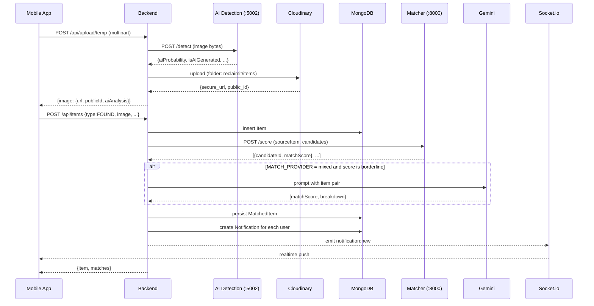
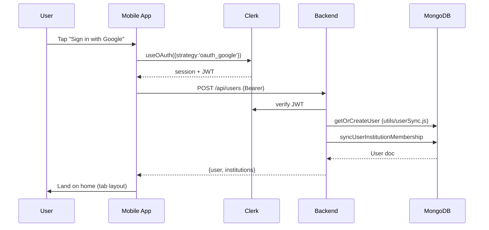
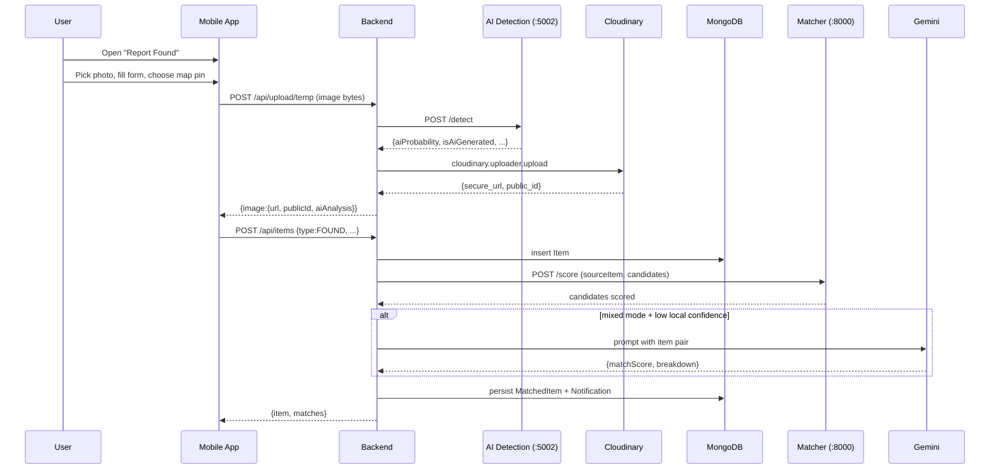
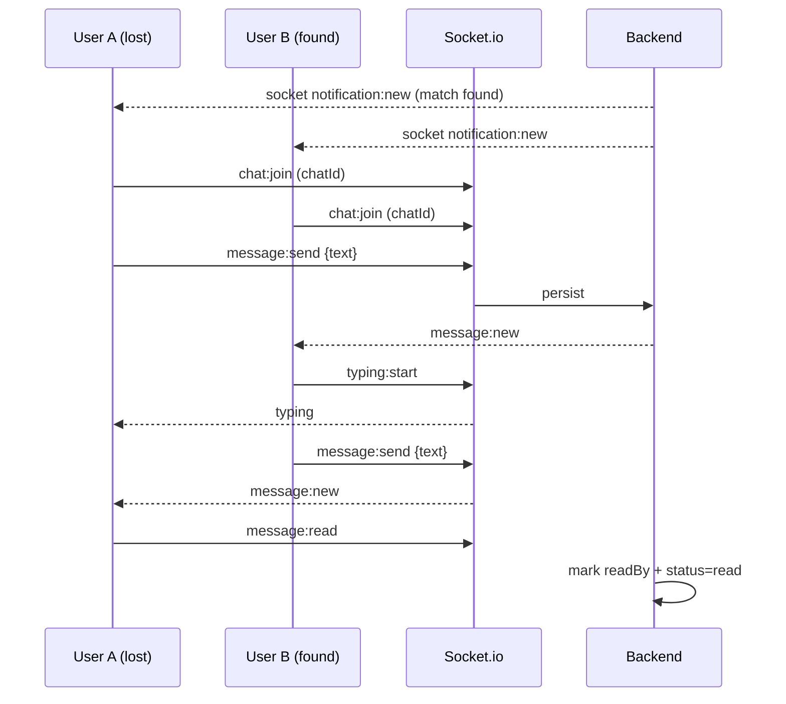

# ReclaimIt — Project Documentation

> A complete reference for the ReclaimIt lost-and-found platform, written for a college project report. Every section can be read independently. File references use `path:line` for direct navigation.

---

## Table of Contents

1. [Project Overview](#1-project-overview)
2. [Tech Stack](#2-tech-stack)
3. [System Architecture](#3-system-architecture)
4. [Folder Structure](#4-folder-structure)
5. [Database Design](#5-database-design)
6. [API Documentation](#6-api-documentation)
7. [Application Workflow](#7-application-workflow)
8. [Frontend Analysis](#8-frontend-analysis)
9. [Backend Analysis](#9-backend-analysis)
10. [Security &amp; Validation](#10-security--validation)
11. [Challenges &amp; Design Decisions](#11-challenges--design-decisions)
12. [Scalability &amp; Future Enhancements](#12-scalability--future-enhancements)
13. [Deployment](#13-deployment)
14. [Conclusion](#14-conclusion)

---

## 1. Project Overview

### 1.1 Problem Statement

Every day, students and commuters lose phones, wallets, IDs, bags, and keys on campuses, in transit hubs, and around city landmarks. Traditional lost-and-found systems are paper-based or scattered across institutional notice boards, so reunion rates are low. Reports are also abused: fake listings, AI-generated images, and scams reduce trust in the system.

### 1.2 Solution

**ReclaimIt** is a multilingual, AI-assisted lost-and-found platform that pairs a lost report with a matching found report automatically. It uses three layers of intelligence:

- A **text-based cross-encoder** model that scores 0–100 how similar two reports are (location, title, color, brand, time).
- A **Google Gemini** fallback model for nuanced descriptions.
- A **SigLIP2 + DINOv2 ensemble** that flags AI-generated or fraudulent images.

The product is delivered as:

- A cross-platform **React Native (Expo)** mobile app for the public.
- A **React + Vite** admin portal for moderators (item queue, user bans, AI detection review, matching config, dispute resolution, institution management).
- A **Node.js + MongoDB** backend with Socket.io real-time chat.
- Two **Python** microservices — one FastAPI matcher, one Flask image-forensics service.

### 1.3 Feature Summary (from `README.md`)

- Report lost or found items with photo, location, brand, color, category, date.
- Automatic AI matching of lost ↔ found reports.
- Real-time chat between matched users (text + voice notes with transcription and Hindi/English translation).
- Multilingual (English / Hindi) UI, persisted in AsyncStorage.
- AI image authenticity check (gating suspicious uploads for review).
- Institution scoping (university domains auto-enrol users as members).
- Admin moderation, manual match override, ban/flag, dispute transcript viewer.

### 1.4 Key Concepts in Plain English

- **Lost report** — a user reports something they have lost.
- **Found report** — a user reports something they have found.
- **Match** — when the system thinks a lost and a found report refer to the same item. Each side is then notified and a chat is opened.
- **Strength** — `strong` (≥70), `medium` (≥50), `weak` (<50) based on the match score.
- **AI analysis** — a flag stored on the item telling moderators whether the image is likely AI-generated.

---

## 2. Tech Stack

### 2.1 One-glance Table

| Layer              | Service                                    | Tech                                             | Version (from manifests)                                                    |
| ------------------ | ------------------------------------------ | ------------------------------------------------ | --------------------------------------------------------------------------- |
| Mobile             | `mobile/`                                | Expo (React Native)                              | expo 54, react-native 0.81.5, react 19.1                                    |
| Admin web          | `admin-web/`                             | Vite + React                                     | vite 6, react 19                                                            |
| Backend            | `backend/`                               | Node.js + Express                                | express 4.21, mongoose 9                                                    |
| Auth               | shared                                     | Clerk (hosted)                                   | @clerk/clerk-sdk-node 4.13, @clerk/clerk-expo 2.11, @clerk/clerk-react 5.24 |
| DB                 | shared                                     | MongoDB (Mongoose)                               | mongoose 9                                                                  |
| Real-time          | `backend/src/config/socket.js`           | Socket.io                                        | socket.io 4.8                                                               |
| Cloud media        | shared                                     | Cloudinary                                       | cloudinary 2.x, multer-storage-cloudinary                                   |
| LLM text           | `backend/src/services/geminiMatching.js` | Google Gemini                                    | gemini-2.5-flash                                                            |
| LLM voice STT/Tx   | `backend/src/controllers/chat.js`        | Google Gemini                                    | gemini-2.5-flash                                                            |
| Matching model     | `AI/lost_found_matcher.py`               | sentence-transformers CrossEncoder               | cross-encoder/ms-marco-MiniLM-L-6-v2                                        |
| AI image detection | `ai-detection-service/model.py`          | SigLIP2 + DINOv2 (LoRA)                          | google/siglip2-so400m-patch14-384, vit_large_patch14_dinov2.lvd142m         |
| Object storage     | shared                                     | Cloudinary (images), local `temp/` (transient) |                                                                             |
| Maps               | `mobile/app/(modals)/report-lost.jsx`    | react-native-maps + OSM tiles                    | react-native-maps 1.20                                                      |
| Voice notes        | `mobile/app/chat-conversation.jsx`       | expo-av                                          |                                                                             |
| Background jobs    | `backend/src/config/cron.js`             | node-cron                                        | cron 4.x                                                                    |

### 2.2 Environment Variables (from `.env` files)

**`backend/.env`** (consumed by `backend/src/server.js` and configs)

| Variable                                                 | Purpose                                                |
| -------------------------------------------------------- | ------------------------------------------------------ |
| `MONGODB_URL`                                          | Mongo connection string                                |
| `PORT`                                                 | Express port (default 5001)                            |
| `NODE_ENV`                                             | `development` / `production` (gates temp cleanup)  |
| `CLERK_PUBLISHABLE_KEY`                                | Frontend Clerk key                                     |
| `CLERK_SECRET_KEY`                                     | Backend Clerk verify key                               |
| `CLOUDINARY_CLOUD_NAME` / `API_KEY` / `API_SECRET` | Cloudinary account                                     |
| `CLOUDINARY_TEMP_FOLDER`                               | Default `reclaimit/temp`                             |
| `CLOUDINARY_ITEMS_FOLDER`                              | Default `reclaimit/items`                            |
| `GEMINI_API_KEY`                                       | Google Gemini key                                      |
| `GEMINI_MODEL`                                         | Default `gemini-2.5-flash`                           |
| `MATCH_PROVIDER`                                       | `mixed` / `local` / `gemini` (default `mixed`) |
| `AI_DETECTION_SERVICE_URL`                             | Default `http://127.0.0.1:5002`                      |
| `AI_DETECTION_ENABLED`                                 | `true` / `false`                                   |

**`mobile/.env`**

- `EXPO_PUBLIC_CLERK_PUBLISHABLE_KEY`
- `EXPO_PUBLIC_API_URL`

**`admin-web/.env`**

- `VITE_CLERK_PUBLISHABLE_KEY`
- `VITE_API_URL`

**`AI/` overrides**

- `MATCHER_MODEL_DIR` (defaults to `<repo>/AI/models`)

---

## 3. System Architecture

ReclaimIt follows a **service-oriented architecture** with five independently deployable services. The mobile and admin clients never talk to the AI services directly — they always go through the backend, which acts as an API gateway and orchestration layer.

### 3.1 High-Level Diagram



### 3.2 Request Flow (Plain English)

1. The mobile app or admin portal authenticates a user through **Clerk** (email/password or Google).
2. Clerk returns a JWT, which the client attaches to every request as `Authorization: Bearer <token>`.
3. The backend **verifies** the token (`backend/src/middleware/clerkAuth.js`), finds or creates the user in MongoDB (`utils/userSync.js`), and gates admin routes with `adminAuth.middleware.js`.
4. Business logic lives in **controllers** under `backend/src/controllers/` and `backend/src/admin/controllers/`. They use **models** (Mongoose) and **services** for AI.
5. For matching, the backend first calls the **local FastAPI matcher** (`AI/matcher_api.py`) which returns a 0–100 score. If `MATCH_PROVIDER=mixed` and the local score is borderline, it falls back to **Gemini** (`backend/src/services/geminiMatching.js`).
6. For every uploaded image, the backend calls the **Flask AI detection** service (`ai-detection-service/app.py`) which returns an `aiProbability`. The result is bucketed into `AI_Generated`, `Possibly_AI_Generated`, `AI_Flags_Present`, `Likely_Genuine`, or `Analysis_Failed` and stored on the item.
7. Real-time chat runs over **Socket.io** with the same JWT verification on connection (`backend/src/config/socket.js`).
8. All long-lived images are in **Cloudinary**; temporary upload-then-detect files live on disk under `backend/temp/` and are pruned every 30 min by a cron job (`config/tempImageCleanup.js`).

### 3.3 Sequence — "User reports a found item"



---

## 4. Folder Structure

```
D:\Downloads\Reclaimit\
├── README.md                  # Top-level feature list and quickstart
├── start-dev.bat              # Windows launcher for all 5 services
├── update-ip.ps1              # Patches mobile/app.json with current WiFi IPv4
├── ReClaimIt1.pdf             # Original problem statement / report
│
├── mobile/                    # Expo React Native app (public users)
│   ├── app/                   # File-based routes (expo-router)
│   │   ├── _layout.jsx        # I18n + Clerk + SafeScreen + Slot
│   │   ├── (auth)/            # Unauthenticated stack
│   │   │   ├── _layout.jsx
│   │   │   ├── sign-in.jsx
│   │   │   └── sign-up.jsx
│   │   ├── (root)/            # Authenticated stack + ban modal
│   │   │   ├── _layout.jsx
│   │   │   └── ...            # detail/match/institution routes
│   │   ├── (tabs)/            # Bottom tab bar pages
│   │   │   ├── index.jsx      # Home
│   │   │   ├── chat.jsx
│   │   │   └── profile.jsx
│   │   ├── (modals)/
│   │   │   ├── report-lost.jsx
│   │   │   └── report-found.jsx
│   │   ├── chat-conversation.jsx
│   │   ├── item/[id]/edit.jsx
│   │   └── oauth-native-callback.jsx
│   ├── components/            # RecentItemCard, BottomNavBar, PageLoader, ...
│   ├── hooks/                 # useItemReportForm, useImageUpload
│   ├── i18n/                  # I18nProvider + EN/HI translations
│   ├── services/              # api.js (axios) and socket.js (SocketService)
│   ├── config/env.js          # Reads EXPO_PUBLIC_* from app.json
│   ├── constants/             # colors (themes) and api (legacy URL)
│   ├── lib/                   # cache (SecureStore token), utils
│   ├── assets/styles/         # report-form, auth, home, create style sheets
│   ├── app.json               # Expo config + extra envs
│   └── package.json
│
├── admin-web/                 # React + Vite admin portal
│   ├── index.html
│   ├── vite.config.js
│   ├── src/
│   │   ├── main.jsx           # ClerkProvider + createRoot
│   │   ├── App.jsx            # AuthGate + Layout + 7 tab pages
│   │   ├── components/        # AuthGate, Layout, AIAnalysisCard, ui
│   │   ├── pages/             # Dashboard, Moderation, Users, Institutions,
│   │   │                        Matching, Disputes, Settings
│   │   ├── services/adminApi.js
│   │   ├── utils/             # adminMappers, format
│   │   ├── data/mockData.js   # Fallback metrics
│   │   └── styles.css
│   ├── public/reclaimit-logo.png
│   └── package.json
│
├── backend/                   # Express + Mongoose + Socket.io API
│   ├── package.json
│   ├── .env
│   ├── temp/                  # Short-lived uploads before Cloudinary push
│   └── src/
│       ├── server.js          # HTTP + Socket.io + cron bootstrap
│       ├── app.js             # Express app, route mounting
│       ├── config/            # db, cloudinary, socket, cron, tempImageCleanup
│       ├── middleware/        # clerkAuth, upload (multer)
│       ├── models/            # user, item, chat, message, matchedItem,
│       │                       # notification, institution
│       ├── routes/            # items, users, upload, matching,
│       │                       # notifications, chat, institutions
│       ├── controllers/       # items, matching, chat, notifications,
│       │                       # institutions
│       ├── services/          # geminiMatching, localMatcher,
│       │                       # metadataAnalysisService
│       ├── admin/
│       │   ├── routes.js
│       │   ├── controllers/   # dashboard, items, users, matching,
│       │   │                   # institutions, chats
│       │   ├── middleware/adminAuth.middleware.js
│       │   ├── models/adminConfig.model.js
│       │   └── utils/         # matchingConfig, constants, ids,
│       │                       # pagination, slugify
│       └── utils/userSync.js  # getOrCreateUser, syncUserInstitutionMembership
│
├── AI/                        # FastAPI cross-encoder matcher
│   ├── matcher_api.py         # POST /score, GET /health
│   ├── lost_found_matcher.py  # LostFoundMatcher class (SentenceTransformers)
│   ├── train_lost_found_matcher.py   # Cross-encoder fine-tuning
│   ├── generate_lost_found_dataset.py # 12k synthetic items + 30k pairs
│   ├── requirements-ml.txt    # torch, sentence-transformers, fastapi, ...
│   ├── models/                # model.safetensors + tokenizer + metadata
│   └── datasets/lost_found_matching/
│       ├── items.json
│       └── training_pairs.json
│
└── ai-detection-service/      # Flask SigLIP2 + DINOv2 AI image detector
    ├── app.py                 # /detect and /health
    ├── model.py               # EnsembleAIDetector, LoRALinear
    ├── test_service.py        # CLI smoke test
    ├── start.bat              # Windows wrapper
    ├── requirements.txt       # flask, transformers, torch, timm, peft
    ├── models/
    │   ├── pytorch_model.pt   # Fine-tuned ensemble weights
    │   ├── siglip2/           # (optional) SigLIP2 weights
    │   └── dinov2/            # (optional) DINOv2 weights
    └── README.md / QUICK_START.md / SETUP_GUIDE.md
```

---

## 5. Database Design

The backend uses **MongoDB** (database name `reclaimit`) with seven first-class collections and a key/value `adminconfigs` collection for runtime matching settings. Mongoose enforces schemas, validators, and pre-save hooks.

### 5.1 Entity-Relationship Diagram

```mermaid
erDiagram
    USER ||--o{ ITEM : "owns (userId)"
    USER ||--o{ CHAT : "participates in"
    USER ||--o{ NOTIFICATION : "receives"
    USER }o--o{ INSTITUTION : "member of"
    ITEM ||--o{ MATCHEDITEM : "appears as sourceItem or matchedItem"
    ITEM ||--o{ CHAT : "linked via items[]"
    CHAT ||--o{ MESSAGE : "contains"
    INSTITUTION ||--o{ USER : "scopes via emailDomains"

    USER {
        ObjectId _id
        string clerkId
        string email
        string name
        string avatar
        string role "USER | ADMIN"
        string status "ACTIVE | BANNED | FLAGGED"
        ObjectId[] institutions
        number reportCount
        number claimCount
    }
    ITEM {
        ObjectId _id
        ObjectId userId
        string type "LOST | FOUND"
        string itemName
        string description
        string category
        string color
        string brandName
        string location.name
        GeoJSON location.coordinates
        Object image { url, publicId, aiAnalysis, isAiGenerated, aiProbability, realProbability }
        string status "ACTIVE | FLAGGED | ARCHIVED | MATCHED | CLAIMED"
        Date date
    }
    CHAT {
        ObjectId _id
        ObjectId[] participants  "exactly 2"
        ObjectId[] items
        ObjectId matchedItem
        Map unreadCount
        string status "active | archived | blocked"
    }
    MESSAGE {
        ObjectId _id
        ObjectId chatId
        ObjectId sender
        string type "text | image | voice | system"
        string content
        Object audio { publicId, duration, mime, transcript{ en, hi, unknown } }
        ObjectId[] readBy
        string status "sent | delivered | read"
    }
    MATCHEDITEM {
        ObjectId _id
        ObjectId sourceItem
        ObjectId matchedItem
        ObjectId sourceUser
        ObjectId matchedUser
        number matchScore
        string matchStrength "strong | medium | weak"
        Object breakdown "locationScore, titleScore, brandScore, colorScore"
        number distanceKm
        string status "pending | accepted | rejected | expired"
        boolean notifications.sentToSource
        boolean notifications.sentToMatched
    }
    NOTIFICATION {
        ObjectId _id
        ObjectId user
        string type
        string title
        string body
        ObjectId item
        Object meta
        boolean read
    }
    INSTITUTION {
        ObjectId _id
        string name
        string slug "unique"
        string description
        string[] emailDomains
        string[] adminEmails
        string status "ACTIVE | INACTIVE"
        Object logo
    }
    ADMINCONFIG {
        ObjectId _id
        string key "unique"
        Mixed value
    }
```

### 5.2 Important Schema Rules

- **User** (`backend/src/models/user.model.js`): indexed on `clerkId` and `email`; `role` defaults to `USER`. `status` can be `ACTIVE`/`BANNED`/`FLAGGED`. Ban and role are updated by the admin portal.
- **Item** (`item.model.js`): `type` is locked to `LOST` or `FOUND`. The image object records Cloudinary `url`/`publicId` and an `aiAnalysis` bucket enum: `AI_Generated | Possibly_AI_Generated | AI_Flags_Present | Likely_Genuine | Analysis_Failed`. `location.coordinates` is a `GeoJSON Point` (`[lng, lat]`) — required for the geo-distance scoring.
- **Chat** (`chat.model.js`): a pre-save hook asserts **exactly two** participants. `unreadCount` is a `Map<userId, number>`. The chat is linked to one or more `items` and optionally a `matchedItem`.
- **Message** (`message.model.js`): `type ∈ {text, image, voice, system}`. Voice messages carry `audio.publicId`, `duration`, `mime`, and a `transcript` map keyed `en | hi | unknown`. The backend stores both `transcriptText` and `translatedText` for inline translation.
- **MatchedItem** (`matchedItem.model.js`): 0–100 `matchScore` plus a pre-computed `matchStrength` (`strong ≥ 70`, `medium ≥ 50`, `weak < 50`). `breakdown` is the per-axis contribution (location, title, brand, color) so the admin UI can show dial widgets. `notifications` flags track whether each user has been pinged.
- **Notification** (`notification.model.js`): per-user feed used for in-app toasts and the bell badge.
- **Institution** (`institution.model.js`): `emailDomains` and `adminEmails` are normalized to lowercase and trimmed; `slug` is unique. The sync helper `syncUserInstitutionMembership` in `utils/userSync.js` matches a user's email domain or the explicit `adminEmails` array to attach memberships and promote admins.
- **AdminConfig** (`admin/admin/models/adminConfig.model.js`): a key/value store. The single current key is `matching`, value:
  ```json
  { "minimumScore": 70, "weights": { "location": 45, "title": 30, "brand": 15, "color": 10 } }
  ```

### 5.3 Indexing Notes

- `user` indexes: `clerkId` (unique), `email` (unique).
- `item` indexes: `userId`, `type`, `status`, plus the implicit GeoJSON index from `location.coordinates` (used by `$geoNear` style matching).
- `matcheditem` indexes: `sourceItem`, `matchedItem`, `sourceUser`, `matchedUser`, `status`.
- `chat` and `message` are denormalized for fast lookups (`participants`, `chatId`).
- `adminconfigs.key` is unique.

---

## 6. API Documentation

All routes are mounted under `/api` in `backend/src/app.js`. Authenticated routes require `Authorization: Bearer <clerk-jwt>`; the Clerk token is verified by `requireAuth` (`backend/src/middleware/clerkAuth.js`).

### 6.1 Health and Auth-light Routes

| Method | Path            | Auth   | Purpose                                                                  |
| ------ | --------------- | ------ | ------------------------------------------------------------------------ |
| GET    | `/api/health` | public | Liveness check (`db`, `cloudinaryConfigured`, `geminiConfigured`). |

### 6.2 Users — `backend/src/routes/users.js`

| Method | Path                            | Purpose                                                                                                            |
| ------ | ------------------------------- | ------------------------------------------------------------------------------------------------------------------ |
| POST   | `/api/users`                  | Sync the Clerk user to Mongo (`utils/userSync.getOrCreateUser`). Called by the mobile app after sign-in/sign-up. |
| GET    | `/api/users/me`               | Returns the current Mongo user.                                                                                    |
| PATCH  | `/api/users/me`               | Update name / avatar / language preference.                                                                        |
| GET    | `/api/users/institutions`     | Institutions the current user belongs to.                                                                          |
| GET    | `/api/users/institutions/:id` | Single institution (member or admin only).                                                                         |

### 6.3 Items — `backend/src/routes/items.js`

| Method | Path                      | Purpose                                                                                                       |
| ------ | ------------------------- | ------------------------------------------------------------------------------------------------------------- |
| POST   | `/api/items`            | Report a new item; triggers auto-matching (`controllers/items.js → matching.controller.autoMatchNewItem`). |
| GET    | `/api/items`            | List items with filters (`type`, `status`, `category`, `q`, pagination).                              |
| GET    | `/api/items/mine`       | Items owned by the caller.                                                                                    |
| GET    | `/api/items/:id`        | Item detail.                                                                                                  |
| PATCH  | `/api/items/:id`        | Edit (only owner). Re-runs matching if relevant fields change.                                                |
| DELETE | `/api/items/:id`        | Delete (owner only).                                                                                          |
| POST   | `/api/items/:id/status` | Update status (`ACTIVE`, `FLAGGED`, `ARCHIVED`, `MATCHED`, `CLAIMED`).                              |

### 6.4 Upload — `backend/src/routes/upload.js`

| Method | Path                  | Purpose                                                                                                                                              |
| ------ | --------------------- | ---------------------------------------------------------------------------------------------------------------------------------------------------- |
| POST   | `/api/upload/temp`  | Multipart upload →`temp/` disk → AI detection call → Cloudinary push → return `{url, publicId, aiAnalysis}`. The local file is then deleted. |
| POST   | `/api/upload/image` | Direct Cloudinary upload for things like chat attachments.                                                                                           |

The temp route is the only one that triggers the Flask AI detection service. It is implemented in `services/metadataAnalysisService.js` with three threshold bands:

- `aiProbability ≥ 0.70` → `AI_Generated`
- `0.50 ≤ p < 0.70` → `Possibly_AI_Generated`
- `0.30 ≤ p < 0.50` → `AI_Flags_Present`
- `p < 0.30` → `Likely_Genuine`
- On error → `Analysis_Failed`

The axios call has a 120 s timeout, so the route degrades gracefully even if the Python service is offline.

### 6.5 Matching — `backend/src/routes/matching.js`

| Method | Path                         | Purpose                                  |
| ------ | ---------------------------- | ---------------------------------------- |
| GET    | `/api/matches`             | List matches involving the current user. |
| GET    | `/api/matches/:id`         | Single match detail.                     |
| POST   | `/api/matches/:id/respond` | Accept / reject a proposed match.        |

### 6.6 Notifications — `backend/src/routes/notifications.js`

| Method | Path                            | Purpose           |
| ------ | ------------------------------- | ----------------- |
| GET    | `/api/notifications`          | List, paginated.  |
| PATCH  | `/api/notifications/:id/read` | Mark one as read. |
| POST   | `/api/notifications/read-all` | Mark all as read. |
| DELETE | `/api/notifications/:id`      | Remove one.       |

### 6.7 Chat — `backend/src/routes/chat.js`

| Method | Path                                   | Purpose                                                    |
| ------ | -------------------------------------- | ---------------------------------------------------------- |
| GET    | `/api/chats`                         | List the user's chats.                                     |
| POST   | `/api/chats`                         | Get-or-create a chat between two users.                    |
| GET    | `/api/chats/:id/messages`            | Message history.                                           |
| POST   | `/api/chats/:id/messages`            | Send a text message.                                       |
| POST   | `/api/chats/:id/voice`               | Send a voice message (multipart, runs through Gemini STT). |
| POST   | `/api/chats/messages/:id/transcribe` | Generate the English transcript on demand.                 |
| POST   | `/api/chats/messages/:id/translate`  | Generate a Hindi/English translation on demand.            |
| DELETE | `/api/chats/:id`                     | Soft delete (status `archived` or `blocked`).          |

### 6.8 Institutions — `backend/src/routes/institutions.js`

| Method | Path                       | Purpose                                       |
| ------ | -------------------------- | --------------------------------------------- |
| GET    | `/api/institutions/mine` | Caller's institutions.                        |
| GET    | `/api/institutions/:id`  | Public institution profile (member or admin). |

### 6.9 Admin — `backend/src/admin/routes.js`

All routes are gated by `requireAuth` then `requireAdmin`. The admin role is read from `publicMetadata.role === "admin"` on the Clerk token and confirmed against the Mongo user.

| Method | Path                                       | Purpose                                                              |
| ------ | ------------------------------------------ | -------------------------------------------------------------------- |
| GET    | `/api/admin/dashboard/stats`             | Counts of active LOST/FOUND, matches, disputes, users, health flags. |
| GET    | `/api/admin/dashboard/analytics?days=14` | Timeseries for the dashboard chart.                                  |
| GET    | `/api/admin/items`                       | List with search + status filter.                                    |
| PUT    | `/api/admin/items/:id`                   | Quick edit (category, description, etc.).                            |
| PUT    | `/api/admin/items/:id/status`            | Approve, flag, archive, claim.                                       |
| DELETE | `/api/admin/items/:id`                   | Hard delete with Cloudinary cleanup.                                 |
| GET    | `/api/admin/users`                       | List with reports/claims aggregates.                                 |
| PUT    | `/api/admin/users/:id/ban`               | Ban / unban.                                                         |
| PUT    | `/api/admin/users/:id/role`              | Promote to admin.                                                    |
| PUT    | `/api/admin/users/:id/status`            | Set status (`ACTIVE`, `FLAGGED`, …).                            |
| GET    | `/api/admin/matching/matches`            | All match records.                                                   |
| POST   | `/api/admin/matching/override`           | Create a manual link with arbitrary score.                           |
| GET    | `/api/admin/matching/config`             | Read the runtime config.                                             |
| PUT    | `/api/admin/matching/config`             | Save new threshold and weights.                                      |
| GET    | `/api/admin/chats/disputes`              | List chats with blocked/recent status.                               |
| GET    | `/api/admin/chats/:id/transcript`        | Flat message list for audit.                                         |
| GET    | `/api/admin/institutions`                | List with filters.                                                   |
| POST   | `/api/admin/institutions`                | Create.                                                              |
| GET    | `/api/admin/institutions/:id`            | Detail.                                                              |
| PUT    | `/api/admin/institutions/:id`            | Update.                                                              |
| DELETE | `/api/admin/institutions/:id`            | Soft-archive.                                                        |
| POST   | `/api/admin/institutions/:id/restore`    | Unarchive.                                                           |
| GET    | `/api/admin/institutions/:id/members`    | Member roll.                                                         |

### 6.10 Real-time Events (Socket.io)

The handshake authenticates with the same Clerk JWT (`io.use` middleware in `config/socket.js`). The socket stores the user id and an in-memory presence map.

| Client event                       | Server reaction                                             |
| ---------------------------------- | ----------------------------------------------------------- |
| `user:join`                      | Adds the user to the online map.                            |
| `chat:join`                      | Joins the room `chat:<chatId>`.                           |
| `message:send`                   | Persists the message and emits `message:new` to the room. |
| `typing:start` / `typing:stop` | Re-broadcast to the other participant.                      |
| `message:read`                   | Updates the message's `readBy` array and status.          |

The HTTP and Socket servers share one Node process started in `server.js`.

---

## 7. Application Workflow

This is the user-facing story. Mermaid sequence diagrams show how the pieces collaborate.

### 7.1 Sign-up and First Sync



`userSync.getOrCreateUser` (in `backend/src/utils/userSync.js`) is idempotent — the same Clerk id always yields the same Mongo user. The membership helper scans every active institution and adds the user to any whose `emailDomains` or `adminEmails` array matches their email.

### 7.2 Report Found Item (with AI Image Check)



### 7.3 Match and Chat



Voice notes follow the same path but with `POST /api/chats/:id/voice` (multipart). The backend streams the file to Cloudinary, then asks Gemini to transcribe (English by default). On demand the recipient can request a translation; results are cached on the `message.transcript` object.

### 7.4 Admin Triage Flow

1. Admin opens the **Moderation** tab. The page hits `GET /api/admin/items?status=...&search=...` and shows the unified queue.
2. The detail panel renders `AIAnalysisCard` (`admin-web/src/components/AIAnalysisCard.jsx`) which colours the result based on `aiAnalysis.isAiGenerated` and shows AI vs Real probabilities.
3. Admin clicks **Approve / Flag / Block / Delete** — each maps to a small set of admin endpoints described in §6.9.
4. For matching, admin can adjust the **threshold** and **weights** in the **AI Matching** tab. The settings are written to `adminconfigs` and re-read on every request via `admin/utils/matchingConfig.js`.

---

## 8. Frontend Analysis

### 8.1 Mobile App (`mobile/`) — Expo + expo-router

The mobile app is a **file-based router** (expo-router 6). Each folder under `app/` defines a route segment. The app uses **native** screens (no `expo-router/dom`).

#### Layouts

- `app/_layout.jsx` is the root. It mounts:
  - `SafeScreen` (respects `react-native-safe-area-context` insets).
  - `I18nProvider` (loads persisted language, exposes `t(key, params)`).
  - `ClerkProvider` (publishable key from `app.json` extra).
  - `Slot` from expo-router.
- `app/(auth)/_layout.jsx` is the unauthenticated stack. It redirects signed-in users to `/`.
- `app/(root)/_layout.jsx` is the authenticated stack. It also subscribes to the `banned` event registered by `services/api.js` and renders a ban modal with a sign-out button.

#### Authentication (`app/(auth)/`)

- `sign-in.jsx` and `sign-up.jsx` use Clerk's `useSignIn`/`useSignUp` and `useOAuth({ strategy: 'oauth_google' })`. After Clerk returns a session, they immediately call `POST /api/users` to mirror the user in MongoDB.
- `oauth-native-callback.jsx` is the redirect target for the native OAuth flow. It just shows `PageLoader`.

#### Tabs (`app/(tabs)/`)

- `index.jsx` — Home. Shows greeting, two big CTAs ("I Lost Something" / "I Found Something"), the recent items list, and the user's notification feed. Items are loaded through `lib/cache.js` (which also exports the `tokenCache` for Clerk secure store) and the `services/api.js` axios client.
- `chat.jsx` — Chat list. Uses `services/socket.js` to subscribe to `notification:new` and `message:new`, marks the user as online, and shows the most recent preview per conversation.
- `profile.jsx` — Profile. Avatar picker (`expo-image-picker`), language modal (drives `I18nProvider`), stats summary, sign-out.

#### Modals (`app/(modals)/`)

- `report-lost.jsx` and `report-found.jsx` share the same form hook, `hooks/useItemReportForm.js`, which owns: location permission + current position (`expo-location`), the image upload pipeline (`useImageUpload.js`), validation, and a lazy-loaded `react-native-maps` view. The map falls back to a text input when the package is not yet installed in development builds.
- After submission, the modal shows a success Alert and pops back to the home tab.

#### Chat Conversation (`app/chat-conversation.jsx`)

- Subscribes to `message:new`, `typing:start/stop`, and presence events.
- Renders messages with read-receipt ticks and a "Transcribe (EN)" / "Translate" button per voice message.
- Records voice with `expo-av`'s `Audio.Recording`, uploads via `useImageUpload.js`, then calls `POST /api/chats/:id/voice`.

#### Services & Hooks

- `services/api.js` — single axios instance. `getAuthenticatedApi(token, getTokenFn)` attaches a Bearer token and exposes `getItems`, `reportItem`, `uploadTempImage`, `sendMessage`, `sendVoiceMessage`, `translateMessage`, `transcribeMessage`, `deleteItem`, `getMyItems`, `getMatches`, `respondToMatch`, `getNotifications`, `markNotificationRead`, `deleteChat`. A 401 response triggers a token refresh; a 403 with `banned=true` triggers the global ban UI.
- `services/socket.js` — `SocketService` class with `connect`, `disconnect`, `joinChat`, `sendMessage`, `sendTyping`, `markRead`, and listener registration helpers. Uses `socket.io-client`.
- `config/env.js` — reads `EXPO_PUBLIC_API_URL` and `EXPO_PUBLIC_CLERK_PUBLISHABLE_KEY` from `app.json` `extra` and throws at startup if they are missing.
- `hooks/useItemReportForm.js` — orchestrates: location permission, reverse geocoding fallback, image upload, suggestions, and form validation. Returns the form state and submit handler.
- `hooks/useImageUpload.js` — `uploadImage(uri, onProgress)` posts to `/api/upload/temp` with `image/jpeg`. Falls back to a simulated 0–100% progress curve if the server doesn't emit progress events.
- `i18n/I18nProvider.jsx` + `i18n/translations.js` — `I18nProvider` keeps `language` in React state, mirrors it to AsyncStorage (`app_language`), and provides `t('section.key', {param: 'value'})`. The translation object is a flat key→string map for English and Hindi.

#### Components

- `components/RecentItemCard.jsx` — list-row with eye/trash buttons. Eye opens a detail modal (location, category, brand, color, description). Trash requires typing the literal word `delete` to confirm.
- `components/BottomNavBar.jsx` — 3-tab nav (Home / Chat / Profile) with localized labels.
- `components/RecentItemsList.jsx` — wrapper that shows a friendly empty state.
- `components/PageLoader.jsx` and `components/SafeScreen.jsx` — utility wrappers.
- `components/SignOutButton.jsx` — confirmation alert then `useClerk().signOut()`.
- `components/AddItemForm.jsx` — an older standalone form, kept for reference but not wired into the main flow.

#### Theme & Config

- `constants/colors.js` defines four themes (coffee, forest, purple, ocean) and exports `COLORS` from the active one. `assets/styles/*.styles.js` files use the same palette directly for module-scoped styles.
- `app.json` declares Expo plugins: `expo-router`, `expo-image-picker`, `expo-location`, `expo-secure-store`, `expo-av`, and configures the dev server with `EXPO_PUBLIC_API_URL` (overwritten by `update-ip.ps1`).

#### Multi-language

Strings are looked up by dotted keys, e.g. `t('report.itemNamePlaceholder')`. The provider supports `{{param}}` interpolation. Languages: `en`, `hi`.

### 8.2 Admin Web (`admin-web/`) — Vite + React

The admin web is a single-page React 19 app styled with hand-rolled CSS (`styles.css`). It uses **Clerk** for auth and **Recharts** for dashboard charts.

#### Entry Point

- `main.jsx` mounts `<ClerkProvider>` and `<App />`. It throws at boot if `VITE_CLERK_PUBLISHABLE_KEY` is missing.
- `App.jsx` holds all client state: the active tab, paginated items/users/matches, the matching config, the selected item/user/institution, the dispute transcript, etc. The seven tabs are:
  1. `Dashboard`
  2. `Moderation`
  3. `Institutions`
  4. `Users`
  5. `Matching` (AI)
  6. `Disputes`
  7. `Settings`

#### Components

- `AuthGate.jsx` — `<SignedOut>` shows a branded sign-in splash with a Clerk `SignInButton`; `<SignedIn>` renders the app shell.
- `Layout.jsx` — fixed left sidebar with the seven nav buttons, brand block, and a security card. Top bar shows the active tab title, the API base URL pill, a notification bell, and a `<UserButton>` for sign-out.
- `AIAnalysisCard.jsx` — colour-coded result card with AI vs Real probabilities, confidence bar, and a narrative summary.
- `ui.jsx` — `PanelTitle`, `AlertRow`, `Badge`, `Info`, `ItemThumb`, `Dial` (recharts pie), `ConfigRange` (range input with label), `EmptyState`.

#### Pages

- `Dashboard.jsx` — four metric cards (active lost, active found, successful returns, open disputes), an area chart for lost-vs-found volume, a usage monitors panel (mock), health alerts (live from `/admin/dashboard/stats`), and a return-efficiency bar chart.
- `Moderation.jsx` — left list with search + status filter; right detail panel with image, AI analysis card, info grid, tag list, and four actions (Approve / Flag / Block / Delete). Quick edit re-PUTs the item with current category/description.
- `Users.jsx` — directory with avatar grid; selected user card shows role, status, reports, claims, karma (computed from status), and three actions (Promote / Flag / Ban toggle).
- `Institutions.jsx` — list of institutions with create/edit form. The form accepts email domains and admin emails as comma/newline-separated text, parses them into lowercased arrays, and POSTs/PUTs to the backend. Each institution card shows member and admin counts, and a refreshable member list.
- `Matching.jsx` — three panels: matches list with score dials (location/title/brand/color), a minimum-threshold slider, and a manual override form (paste lost/found item ids, save, notify users).
- `Disputes.jsx` — chat disputes list with priority badges; selecting one loads its transcript via `GET /api/admin/chats/:id/transcript`. Each transcript is rendered as alternating speaker messages with action buttons.
- `SettingsPanel.jsx` — category manager, AI config sliders (min score + 4 weights), and Cloudinary policy toggles. Saving writes back to `/api/admin/matching/config`.

#### Services

- `services/adminApi.js` — `createAdminApi(getToken)` returns an object with one method per admin endpoint. The `request` helper injects the Clerk JWT and parses JSON. `toQuery` builds `URLSearchParams` while skipping empty values and the literal `"All"`.
- `utils/adminMappers.js` — converts Mongoose docs into the flattened shapes the UI expects (id, title, owner, status, image, aiAnalysis, etc.). `buildAnalytics` merges the dashboard's item volume and match volume into the chart series.
- `data/mockData.js` — fallback numbers, nav list, and a category list used while real data loads.

---

## 9. Backend Analysis

### 9.1 Process Bootstrap

`backend/src/server.js` is the only entry point.

1. Loads `dotenv` config.
2. Calls `connectDB()` (`config/db.js`).
3. Calls `startCron()` (self-ping every 14 minutes) and `startTempImageCleanup()` (only in production, every 30 minutes).
4. Creates an HTTP server, attaches Socket.io with Clerk auth, and starts `app` (`config/socket.js`).
5. Listens on `process.env.PORT || 5001`.

`backend/src/app.js` registers global middleware (CORS, JSON body parser, request logger), mounts all route modules under `/api`, and exposes `GET /api/health`.

### 9.2 Middleware

- `middleware/clerkAuth.js` — `requireAuth`:
  1. Reads `Authorization: Bearer <token>`.
  2. Calls `clerkClient.verifyToken(token)`.
  3. `getOrCreateUser` from `utils/userSync.js` to mirror the user in Mongo.
  4. Attaches `req.user`.
  5. Throws 401 if the token is invalid, 403 if the user is `BANNED`.
- `middleware/upload.js` — `multer.diskStorage` to `backend/temp/`, and a Cloudinary storage variant. Files are deleted from disk after the AI detection call.
- `admin/middleware/adminAuth.middleware.js` — `requireAdmin`:
  1. Calls `requireAuth` first.
  2. Reads `publicMetadata.role` from the verified token.
  3. Falls back to the Mongo `user.role` field.
  4. Throws 403 if neither is `admin`.

### 9.3 Models (Mongoose)

All seven Mongoose models live in `backend/src/models/`. They use:

- Pre-save hooks (chat enforces two participants).
- Custom validators (item brand-name regex, image-extension regex, etc.).
- Compound indexes for high-frequency queries.
- GeoJSON points for location.

The admin config is stored as a single document with `key: 'matching'`, allowing future keys (e.g. abuse thresholds) to be added without schema migrations.

### 9.4 Routes and Controllers

Each route file in `backend/src/routes/` is a thin wrapper around its controller. Controllers are grouped by feature:

- `controllers/items.js` — create / list / update / delete + status transitions. After every create or relevant update, it calls `matchingController.autoMatchNewItem`.
- `controllers/matching.js` — `autoMatchNewItem` (the workhorse), `findMatches`, and a `respond` handler. The auto-match flow:
  1. Pulls the opposite-type candidates within 20 km (`MIN_MATCH_SCORE = 40`).
  2. For each candidate, calls the **local matcher** (`services/localMatcher.js`) which POSTs to `http://127.0.0.1:8000/score`.
  3. If `MATCH_PROVIDER === 'mixed'` and the local score is borderline, calls `services/geminiMatching.js` for a richer breakdown.
  4. Computes weighted scores using the live `matchingConfig` from `admin/utils/matchingConfig.js`.
  5. Persists `MatchedItem` for each pair above threshold, sends a `Notification` to both users, and emits a Socket.io event.
- `controllers/chat.js` — `getOrCreateChat`, list, send text, send voice (with Cloudinary + Gemini STT), transcribe on demand, translate on demand, delete.
- `controllers/notifications.js` — paginated read, mark single/all read, delete.
- `controllers/institutions.js` — public read endpoints, scoped by membership.

### 9.5 Services

- `services/geminiMatching.js` — formats a JSON-only prompt for `gemini-2.5-flash`, returns a `matchScore` 0–100 plus per-axis scores. Helpers: `clamp`, `parseJsonFromText` (handles code-fenced JSON in Gemini responses).
- `services/localMatcher.js` — `scoreCandidates(sourceItem, candidates)` POSTs to `AI/matcher_api.py` with a 30 s `AbortController` timeout. Returns `null` on failure so the controller can decide to fall back to Gemini.
- `services/metadataAnalysisService.js` — calls the Flask `/detect` endpoint. Buckets the result into the 5-state enum. 120 s axios timeout, graceful degradation.

### 9.6 Real-time Layer

`backend/src/config/socket.js` exports a function that:

1. Reads the JWT from the handshake `auth.token` (or `Authorization` header).
2. Verifies it with Clerk.
3. Stores `socket.data.user = { id, name }`.
4. Maintains a `connectedUsers` Map for presence.
5. Wires events: `user:join`, `chat:join`, `message:send`, `typing:start`, `typing:stop`, `message:read`.

Server-side it persists messages, updates `unreadCount` on the chat, and emits `message:new` to the room.

### 9.7 Scheduled Jobs

- `config/cron.js` — every 14 minutes, fetches `${process.env.API_URL || 'http://127.0.0.1:5001'}/api/health` to keep free-tier hosts warm.
- `config/tempImageCleanup.js` — every 30 minutes, lists Cloudinary resources in `reclaimit/temp` older than 1 hour that are not referenced by any Item, then destroys them. Only runs when `NODE_ENV=production`.

### 9.8 Admin Module

- `admin/routes.js` mounts everything under `/api/admin`. Each route is `requireAuth` + `requireAdmin` then the controller method.
- `admin/controllers/dashboard.controller.js` aggregates counts with `Promise.all` over the relevant collections and adds a `health` object that powers the admin alert card.
- `admin/controllers/items.controller.js` adds pagination, free-text search across `itemName`, `description`, `location.name`, and overrides status with audit-friendly reason notes.
- `admin/controllers/users.controller.js` returns reportCount/claimCount by aggregating over the items collection.
- `admin/controllers/matching.controller.js` returns all matches (most recent first), exposes the manual override endpoint, and the config GET/PUT.
- `admin/controllers/institutions.controller.js` is the most feature-rich: create/update with normalized email lists, soft-archive, restore, and member listing.
- `admin/controllers/chats.controller.js` lists "dispute" chats (status = blocked, or any chat with messages) and exposes a flat transcript endpoint for the audit viewer.
- `admin/models/adminConfig.model.js` is the key/value store.
- `admin/utils/matchingConfig.js` reads/writes the config with sensible defaults (`minimumScore = 70`, weights `45/30/15/10`).
- `admin/utils/constants.js` defines `getMatchStrength(score)` (70/50 cut-off) and other enums.

### 9.9 AI Match Service (`AI/`)

- `matcher_api.py` — FastAPI app exposing `POST /score` and `GET /health`. On startup it loads `LostFoundMatcher(model_dir)`.
- `lost_found_matcher.py` — `LostFoundMatcher` class wrapping a `sentence_transformers.CrossEncoder`. Builds the input text per item using `item_to_match_text`, which formats type, title, description, category, color, brand, date, location name, coordinates, and (for the cross-item view) the Haversine distance.
- `train_lost_found_matcher.py` — fine-tunes a cross-encoder with group-aware splitting (avoids leakage), balanced positive/negative pairs, validation/test metrics, and writes `matcher_metadata.json`. Default base model: `cross-encoder/ms-marco-MiniLM-L-6-v2`. The bundled `matcher_metadata.json` reports `accuracy/precision/recall/f1 = 1.0` on the synthetic test set.
- `generate_lost_found_dataset.py` — generates **12 000 items** in 30 000 balanced pairs across 3 000 group archetypes. Categories: electronics, documents, clothing, accessories, other. Locations: 30 real-world landmarks across Nepal and India. Colors, brands, and details are sampled from category-specific dictionaries.
- `models/model.safetensors` and `models/tokenizer.json` ship the pre-trained weights.

### 9.10 AI Image Detection Service (`ai-detection-service/`)

- `app.py` — Flask app exposing `POST /detect` (multipart `image`) and `GET /health`. On boot it tries to load `models/pytorch_model.pt`; if missing, it pulls the public HuggingFace repo `Bombek1/ai-image-detector-siglip-dinov2` and caches the weight.
- `model.py` — defines:
  - `LoRALinear` — a custom LoRA layer wrapping DINOv2's QKV linear projections.
  - `ClassificationHead` — LayerNorm + MLP + GELU + Dropout that maps the concatenated SigLIP2 + DINOv2 features to a single logit.
  - `EnsembleAIDetector` — runs SigLIP2 (`google/siglip2-so400m-patch14-384`) and DINOv2 (`vit_large_patch14_dinov2.lvd142m`) in parallel and concatenates their pooled features.
  - `create_model_with_lora` — applies PEFT LoRA to SigLIP2 (`q_proj`/`v_proj`) and the custom `LoRALinear` to DINOv2's QKV.
  - `AIImageDetector` — high-level API. `predict(image)` preprocesses the image with the SigLIP2 processor and a torchvision transform (BICUBIC resize to 392, ImageNet normalization), runs a forward pass, applies a sigmoid, and returns `{probability, prediction, confidence}`.
- `test_service.py` — CLI smoke test for `/health` and `/detect`.
- `start.bat` — Windows wrapper that runs `python app.py`.

---

## 10. Security & Validation

| Concern                | How ReclaimIt handles it                                                                                                                                                                                                                              |
| ---------------------- | ----------------------------------------------------------------------------------------------------------------------------------------------------------------------------------------------------------------------------------------------------- |
| Authentication         | All clients use**Clerk** (hosted). The backend never stores passwords. JWTs are verified on every request via `@clerk/clerk-sdk-node` (`clerkAuth.js`).                                                                                     |
| Authorization          | `requireAuth` gates every non-public route. `requireAdmin` (in `admin/middleware/adminAuth.middleware.js`) checks `publicMetadata.role` first, then falls back to the Mongo user, ensuring both Clerk metadata and DB are aligned.            |
| Banning                | When an admin sets a user to `BANNED`, the next request fails `requireAuth` with HTTP 403. The mobile API client's response interceptor (`services/api.js`) detects `banned: true` and triggers a global ban modal that only offers sign-out. |
| Image abuse            | Every uploaded image is run through the SigLIP2 + DINOv2 ensemble before being accepted. The 5-state result is stored on the item and shown in the admin's `AIAnalysisCard`.                                                                        |
| Data loss prevention   | `tempImageCleanup.js` cron job prevents orphaned Cloudinary objects. The HTTP keep-alive ping in `cron.js` keeps the backend alive on free-tier hosts.                                                                                            |
| File size              | Multer's disk storage is bounded by the request body parser limits. Image-extension regex on the Item model rejects unexpected file types.                                                                                                            |
| CORS                   | Configured centrally in `app.js` to allow the admin web origin and the mobile dev server.                                                                                                                                                           |
| Body limits            | `express.json` is left at default for routes; multer handles multipart bodies.                                                                                                                                                                      |
| Secrets                | All secrets live in `backend/.env` (Mongo, Clerk, Cloudinary, Gemini). The mobile and admin web only see publishable keys.                                                                                                                          |
| Voice data             | Voice notes are stored in Cloudinary; transcripts and translations are stored as plain strings on the message document.                                                                                                                               |
| Socket security        | Socket.io handshake is gated by Clerk token verification (`io.use` middleware). Only authenticated users can join chat rooms.                                                                                                                       |
| Admin override         | The `POST /api/admin/matching/override` route allows the admin to force a match even with a 100 score. This is intentionally privileged and only accessible by admins.                                                                              |
| User-generated content | `requireAuth` and ownership checks on item updates/deletes. Admins can override but every change is reflected in the audit log.                                                                                                                     |

---

## 11. Challenges & Design Decisions

### 11.1 Choosing an AI stack

**Decision:** Use a *local* cross-encoder for matching and a *self-hosted* SigLIP2 + DINOv2 ensemble for image detection, with Gemini as a fallback.
**Why:** The product is a college project and must run on free / cheap infrastructure. The cross-encoder gives reproducible 0–100 scores without an API bill, and the image detector is privacy-preserving (no image leaves the server). Gemini is kept as a fallback because LLM reasoning is great for noisy free-text descriptions.

### 11.2 Mixed matching provider

**Decision:** `MATCH_PROVIDER=mixed` by default, calling the local matcher first and Gemini only when the local score is borderline.
**Why:** A fast, cheap local pass handles the long tail. Gemini is reserved for cases where the text is sparse or the local model is uncertain, which balances cost and quality.

### 11.3 Auth in three different runtimes

**Decision:** Centralize auth in Clerk and only ever store `clerkId` in our own database.
**Why:** Implementing secure auth in Express, Expo, and Vite is a maintenance burden. Clerk gives OAuth, MFA, and JWTs out of the box, and `getOrCreateUser` keeps our `User` collection in sync.

### 11.4 Geo-aware matching

**Decision:** Score with a Haversine distance in both the local matcher and the Gemini prompt.
**Why:** A 95%-text match is meaningless if the items are 500 km apart. Distance is the strongest single signal of a real match.

### 11.5 Single-port dev environment

**Decision:** Five services on five ports (5001, 5002, 8000, 5173/5174, 8081) orchestrated by `start-dev.bat`.
**Why:** Each service has a different runtime and a different startup time; a single Node process would not be able to load the Python models. The script opens five Windows Terminal panes so a developer can see every log.

### 11.6 Image upload → detect → store

**Decision:** Push the image to a `temp/` folder first, run the detector, then upload to Cloudinary and delete the local copy.
**Why:** The detector needs raw bytes and a stable path. Pushing to Cloudinary first would waste storage on rejected images and double the network bill. The cron job in `tempImageCleanup.js` is the safety net for the few images that never reach Cloudinary.

### 11.7 Synthetic training data

**Decision:** Generate 12k synthetic items and 30k balanced pairs locally instead of scraping real reports.
**Why:** No public lost-and-found corpus exists at the scale we need, and using real reports would be a privacy issue. The synthetic generator explicitly injects hard negatives (same category, same color, nearby location, token overlap) to teach the model what "looks similar but is not a match" means.

### 11.8 Polyglot service mesh

**Decision:** Three different languages in the backend stack (Node, Python for matcher, Python for image detection).
**Why:** The right tool for the right job. Node + Express is the lightest path for an HTTP API, FastAPI is the natural fit for serving a PyTorch model, and Flask is a single-file process that boots in 2 s — which is exactly what we want for a microservice that the backend hits on every upload.

### 11.9 Socket.io + REST coexistence

**Decision:** Real-time features (chat, typing, presence) ride on Socket.io; everything else uses REST.
**Why:** The mobile app needs to subscribe to `message:new` and `notification:new` without polling, but the rest of the surface is one-shot request/response where REST is simpler.

### 11.10 Runtime-tunable matching

**Decision:** Store the threshold and weights in `adminconfigs.matching` and have the controller read them on every call.
**Why:** Tuning is empirical — an admin should be able to nudge weights without redeploying.

---

## 12. Scalability & Future Enhancements

### 12.1 What already scales well

- **Stateless Node backend** — multiple instances behind a load balancer; Socket.io can be moved to the Redis adapter when needed.
- **MongoDB** — horizontal scale via replica set / sharding; geo-index on items scales with the standard Mongo geo operators.
- **Local matcher** — the cross-encoder is small (~100 MB) and runs on CPU; an additional instance can be added behind a simple round-robin proxy.
- **Image detector** — Flask runs a single-process PyTorch inference; switching to TorchServe or Triton would allow GPU-backed multi-model serving.

### 12.2 Concrete next steps

1. **Push notifications** — integrate Expo Push or FCM so users get notified even when the app is closed.
2. **Edge-based geo search** — Mongo `2dsphere` index + `$geoNear` for "items near me" feeds.
3. **Per-tenant config** — institutions can override the matching threshold to tune for their campus size.
4. **Re-train on real data** — once a corpus of confirmed matches exists, fine-tune the cross-encoder on real reports and replace the synthetic-only model.
5. **Stronger image detection** — swap the SigLIP2 + DINOv2 ensemble for a 3-class model (`REAL`, `AI_IMAGE`, `SCREEN_PHOTO`) to catch the new wave of GAN- and diffusion-based fakes.
6. **On-device matching** — the mobile app can pre-rank candidates using a small embedding model, only sending the top-K to the backend. This cuts the per-report cost dramatically.
7. **Audit log** — persist every admin action (who changed what, when) into a dedicated `audit_logs` collection for compliance.
8. **SSO for institutions** — add SAML / OIDC connectors for universities that already run their own identity provider.
9. **Bilingual models** — the dataset is currently English-only. Adding Hindi and Nepali descriptions would improve recall for our target audience.
10. **Public REST API** — once auth is stable, expose a documented v1 REST API for partner integrations (e.g. campus security systems).

---

## 13. Deployment

### 13.1 Local Development

1. Install Node 20+ and Python 3.10+.
2. **Backend**
   ```bash
   cd backend
   npm install
   npm run dev    # nodemon src/server.js
   ```
3. **AI Image Detection**
   ```bash
   cd ai-detection-service
   pip install -r requirements.txt
   python app.py  # or start.bat on Windows
   ```
4. **AI Matcher**
   ```bash
   cd AI
   pip install -r requirements-ml.txt
   uvicorn matcher_api:app --host 0.0.0.0 --port 8000
   ```
5. **Admin Web**
   ```bash
   cd admin-web
   npm install
   npm run dev
   ```
6. **Mobile App**
   ```bash
   cd mobile
   npm install
   npx expo start
   ```
7. Or, on Windows, run `start-dev.bat` from the project root to open all five in separate terminal panes. `update-ip.ps1` will rewrite `mobile/app.json` with the laptop's current WiFi IPv4 so Expo Go on a physical device can reach the backend.

### 13.2 Production Targets

- **Backend** — any Node host (Render, Railway, Fly, AWS ECS). Set `NODE_ENV=production` so the temp-cleanup cron activates. Provide env vars: `MONGODB_URL`, Clerk keys, Cloudinary keys, `GEMINI_API_KEY`, `AI_DETECTION_SERVICE_URL`, `MATCH_PROVIDER`, `API_URL`.
- **AI services** — Fly / Render / a small GPU VM. They expose plain HTTP so a reverse proxy with TLS is enough. Pin Python version via `requirements*.txt`.
- **Admin web** — static build (`npm run build` → `dist/`) on Cloudflare Pages, Vercel, or Netlify. Configure `VITE_CLERK_PUBLISHABLE_KEY` and `VITE_API_URL`.
- **Mobile** — Expo EAS Build for both stores; configure `eas.json` to point at the production API URL.

### 13.3 Observability

- The backend logs to stdout. A free-tier **PM2** or `systemd` service can be used for restarts.
- The cron keep-alive ping also serves as a basic liveness signal.
- The admin Dashboard's "Health alerts" panel shows database / Cloudinary / Gemini status in real time.

### 13.4 Environment Cheat-Sheet

| Service                    | Port | URL                              |
| -------------------------- | ---- | -------------------------------- |
| Backend (HTTP + Socket.io) | 5001 | `http://localhost:5001/api`    |
| AI Image Detection (Flask) | 5002 | `http://localhost:5002/detect` |
| AI Matcher (FastAPI)       | 8000 | `http://localhost:8000/score`  |
| Admin Web (Vite)           | 5173 | `http://localhost:5173`        |
| Mobile (Expo)              | 8081 | `http://<laptop-ip>:8081`      |

---

## 14. Conclusion

ReclaimIt is a **production-shaped, polyglot, AI-first** lost-and-found platform. It is intentionally built as a small set of loosely coupled services so each layer can evolve independently:

- The **mobile app** is a fast, accessible Expo experience that handles sign-in, image capture, geolocation, real-time chat, and multilingual UX.
- The **backend** is a thin Node API that owns persistence, authentication, and orchestration of all AI calls. It is small enough to reason about end-to-end and rich enough to demonstrate real engineering concerns (cron jobs, file uploads, multi-provider AI, real-time sockets, RBAC, audit endpoints).
- The **admin web** showcases the same data from a moderator's perspective and proves that the system is operable, not just a demo.
- The **AI services** show that "AI features" can be deterministic, self-hostable, and explainable. The matcher is a small cross-encoder; the image detector is a SigLIP2 + DINOv2 ensemble with LoRA adapters — both come with training scripts, datasets, and evaluation metrics.

### 14.1 What this demonstrates

- Full-stack engineering across Node, Python, React, and React Native.
- Production patterns: env-based config, scheduled jobs, RBAC, file uploads, real-time comms, graceful degradation.
- Applied ML: a custom-trained cross-encoder, a custom dataset generator, and integration of a third-party vision model — all wired into a real product.
- Thoughtful UX: multilingual UI, ban flow, image abuse detection, manual admin override.

### 14.2 What to try first

1. **Sign in** with Google on the mobile app, report a lost item with a real photo, then report a similar found item from another account and watch the chat open in real time.
2. **Open the admin portal** in a browser, sign in with an admin Clerk account, and watch the item appear in the moderation queue with the AI analysis card.
3. **Read the logs** of the Python matcher while a report is created — the FastAPI service will show the `/score` call and the JSON it returns.

The codebase is intentionally readable: every folder has a clear single responsibility, every service has a one-line README, and the cross-service contracts are visible in the controllers and route definitions. A new contributor should be able to land a meaningful change in their first afternoon.

---

*Documentation generated by reading the source. All file references use the format `path:line` for direct navigation inside the repository.*
